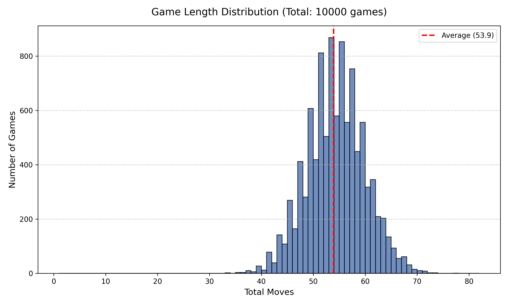
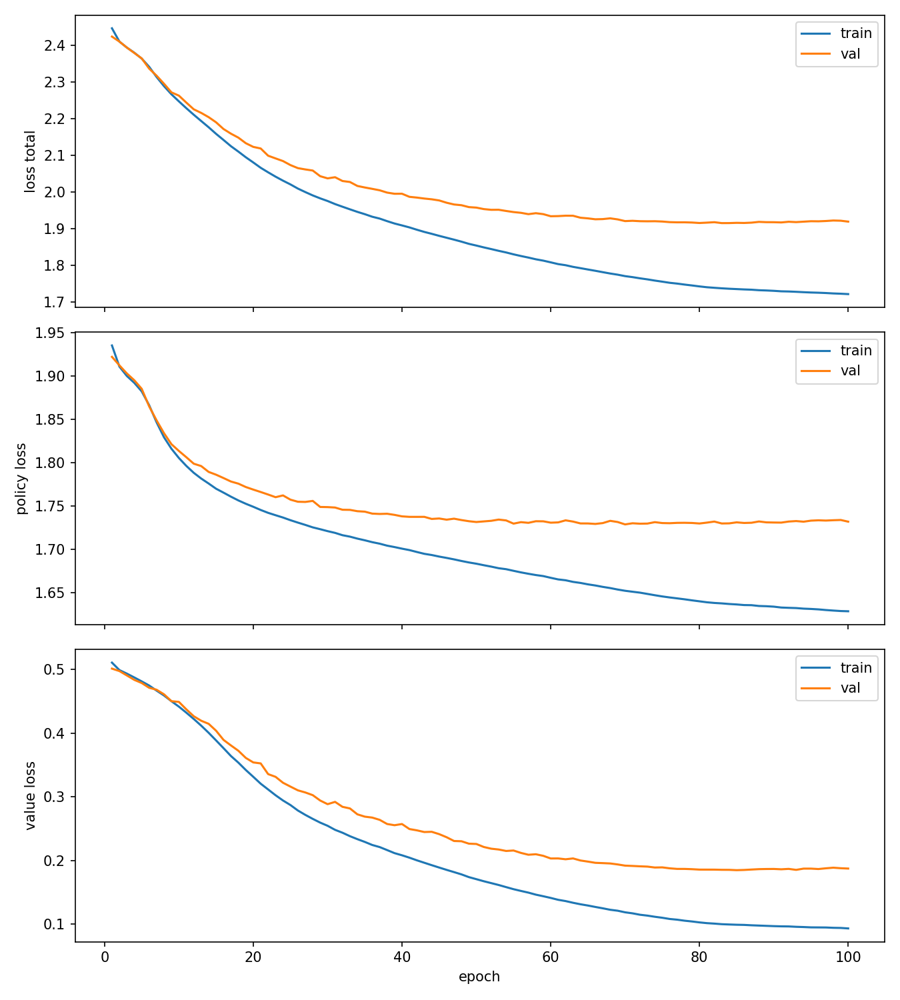

[](https://classroom.github.com/a/vaeSCq55)
#  SI2 - Ultimate-TicTacToe

## Authors

* **Nuno Loureiro** - 130645
* **Orlando Marinheiro** - 114060

Ultimate Tic-Tac-Toe is a strategic variation of the classic Tic-Tac-Toe game. It is played on a 9×9 grid composed of nine 3×3 sub-grids called *micro-boards*. The objective is to win three micro-boards in a row, column, or diagonal on the larger 3×3 *macro-board*.

Players take turns placing their mark in one of the 81 empty cells. The position of a move within a micro-board determines which micro-board the opponent must play in next. For example, playing in the top-right cell of a micro-board sends the opponent to the top-right micro-board. If that micro-board is already won or full, the opponent gets a *free move* and may play in any available cell across the entire board.

## Game Rules

1. **Macro-board vs. Micro-boards**: The game is won by capturing three micro-boards in a row, column, or diagonal on the macro-board.
2. **Next Micro-board**: The cell chosen within a micro-board dictates which micro-board the opponent must play in next.
3. **Local Win**: A micro-board is won by aligning three marks within that 3×3 grid. Once won, it is locked for the rest of the game.
4. **Free Move**: If a player is sent to a micro-board that is already won or full, they may play in any empty cell in any unresolved micro-board.
5. **Draw**: If the macro-board fills up with no winner, the game is declared a draw.

### Game State Example
The game state is broadcast as a JSON object:
```json
{
  "type": "state",
  "current_turn": 1,
  "board": [[0, 0, ...], ...],
  "macro_board": [[0, 0, 0], [0, 0, 0], [0, 0, 0]],
  "active_macro": [1, 1],
  "valid_actions": [[3, 3], [3, 4], [3, 5], [4, 3], [4, 4], [4, 5], [5, 3], [5, 4], [5, 5]]
}
```

### Possible Actions
An agent responds with a move:
```json
{
  "action": "move",
  "x": 4,
  "y": 4
}
```

## Setup

1. **Launch the Simulation**:
    Start the backend and frontend using Docker Compose:
    ```bash
    docker compose up
    ```
    The frontend will be available at [http://localhost:8080](http://localhost:8080).

2. **Run Agents Locally**:
    Create a virtual environment and install dependencies:
    ```bash
    python3 -m venv venv
    source venv/bin/activate
    pip install -r requirements.txt
    ```
    Execute the agents:
    ```bash
    python agents/dummy_agent.py
    # and in another terminal
    python agents/manual_agent.py
    ```

    Other available agents:
    ```bash
    python agents/minmax_agent.py
    python agents/pvn_agent.py
    ```
## Data Generation & Training (CLI Tool)

The project includes an orchestrator at `mcts/cli.py` that allows you to generate data, visualize it, and train the Policy Value Network through a command-line interface.

```bash
python mcts/cli.py <command> [options]
```

### Available Commands

#### 1. Generating Data with C (`generateC`)
The recommended method — significantly faster than the Python version.

```bash
python mcts/cli.py generateC --total-games 1000 --num-simulations 10000 --num-workers 4
```

- `--total-games`: Total number of games to simulate (default: `10000`).
- `--num-simulations`: Number of MCTS simulations per move (default: `50000`).
- `--num-workers`: Number of parallel threads/workers (default: `8`).
- `--seed`: Random seed for reproducibility (default: `42`).
- `--output-dir`: Output directory for generated dataset files (default: `raw_data`).

#### 2. Generating Data with Python (`generatePy`)
Equivalent to the C generator but implemented in Python — considerably slower.

```bash
python mcts/cli.py generatePy --total-games 100 --num-simulations 1000
```

#### 3. Visualizing Data (`visualize`)
Explores and visualizes the generated game records (game length histogram).

```bash
python mcts/cli.py visualize --data-dir mcts/raw_data
```

#### 4. Training the Network (`train`)
Trains the PVN model using the generated data.

```bash
python mcts/cli.py train --epochs 50 --batch-size 512 --data-path mcts/raw_data
```

- `--epochs`: Maximum number of training epochs.
- `--batch-size`: Batch size for training (default: `512`).
- `--lr`: Learning rate (default: `1e-4`).
- `--early-stop-patience`: Patience epochs for early stopping (default: `5`).
- `--early-stop-min-delta`: Minimum improvement delta (default: `1e-4`).
- *(others: `--weight-decay`, `--val-split`, `--device`, `--seed`, `--plot-path`, etc.)*

## Project Structure

- `backend/`: Python server using `websockets`.
  - `server.py`: Main simulation engine. Handles game logic, move validation, and state broadcasting.
  - `Dockerfile`: Containerization setup for the backend.
- `frontend/`: HTML5 Canvas-based visualization.
  - `index.html`: UI structure.
  - `script.js`: Frontend logic, WebSocket client, and Canvas rendering.
  - `styles.css`: Visual styling.
  - `favicon.svg`: Project logo.
- `agents/`: Autonomous agents that connect to the backend.
  - `base_agent.py`: Abstract base class for all agents.
  - `dummy_agent.py`: A simple agent that picks moves randomly.
  - `manual_agent.py`: An agent for manual control via the CLI.
  - `minmax_agent.py`: An agent using the MinMax algorithm with alpha-beta pruning.
  - `pvn_agent.py`: An agent combining the Policy Value Network with MCTS.
- `mcts/`: MCTS and PVN implementation. Includes data generation tools (C and Python), training scripts, and models.
- `minmax/`: MinMax algorithm implementation.
- `benchmark_arena.py`: Headless benchmark tool to simulate and evaluate games between agents concurrently.
- `compose.yml`: Docker Compose configuration for running the full stack.
- `requirements.txt`: Python dependencies.

---

Detailed documentation can be found [here](https://mariolpantunes.github.io/si2-ultimate-tictactoe/).


## Agents & Algorithms

This project includes several agents demonstrating different approaches to solving Ultimate Tic-Tac-Toe, combining classical search algorithms with modern AI methods.

### 1. MinMax Agent (`minmax_agent.py`)

The classical **MinMax** algorithm with **Alpha-Beta Pruning** was adapted to determine the best move at each turn.

Due to the game's high branching factor, the decision tree search is limited to a maximum depth (`max_depth=3`). When the search does not reach a definitive terminal state, a **heuristic evaluation function** assesses the quality of the board:

- Strongly rewards controlling the **center** and **corners** of the macro-board.
- Values strategic positions within each micro-board (center and corners of each 3×3 grid).
- Applies bonuses and penalties for scenarios that grant or concede a *free move*.

### 2. MCTS & Synthetic Data Generation

A dedicated **Monte Carlo Tree Search (MCTS)** algorithm operating in *self-play* mode (MCTS vs itself) was used to generate high-quality synthetic data for training the neural network.

**Simulation statistics:**
- Total compute time: ~52 hours.
- **10,000 complete games** generated.
- **50,000 MCTS simulations** per individual move.

**What is saved per move (`.jsonl` files):**

For each turn of each game, the following is recorded: the current board state (`state`), the player to move (`player_turn`), the **MCTS visit distribution over all legal actions** (the proportion of simulations that visited each possible move), and the final game result (`final_game_result`: win, loss, or draw).

This data is later processed by `dataset_pp.py` to teach the neural network not *what move to play rigidly*, but to **replicate the probability distribution that MCTS would produce**, combined with the actual probability of winning from that position.

**Final dataset statistics:**
- Total states loaded: **539,048**
- **Train:** 485,144 samples | **Validation:** 53,904 samples

The histogram below shows the game length distribution across the 10,000 synthetic games. Games averaged **~53.9 moves**, with a roughly bell-shaped distribution slightly skewed to the left.



### 3. Policy Value Network (`pvn_agent.py`)

The main agent is built around a ResNet-based **PVN (Policy-Value Network)**, inspired by the AlphaZero architecture.

The network produces two outputs:
- **Value Head**: estimates the probability of winning from the current state (output in [-1.0, +1.0] via Tanh).
- **Policy Head**: estimates which of the 81 cells is most likely to be the best move.

**Network Input (4 channels, tensor 4×9×9):**

To make the network agnostic to player identity and focused on its own attack perspective, the input is built from four distinct channels:

1. **Channel 0 – Own pieces**: 1 where the current player has pieces, 0 elsewhere.
2. **Channel 1 – Opponent's pieces**: 1 where the opponent has pieces, 0 elsewhere.
3. **Channel 2 – Player identity**: entire board set to +1.0 (player 1) or -1.0 (player 2).
4. **Channel 3 – Legal move mask**: 1 in cells where it is legal to play, 0 elsewhere.

**Architecture:**
- Initial convolution layer (4 → 256 channels).
- 5 ResNet blocks (256 channels, 3×3 convolutions with padding).
- *Policy Head*: 1×1 convolution → flatten → Linear(162, 81).
- *Value Head*: 1×1 convolution → Linear(81, 64) → Linear(64, 1) → Tanh.

**Loss Function (AlphaZero Loss):**
- *Value loss*: MSE between the predicted value and the actual game outcome (+1 win, -1 loss, 0 draw).
- *Policy loss*: cross-entropy between the predicted distribution and the MCTS visit distribution (with a mask to ignore illegal actions).
- Total loss is the sum of both components.

**Data Augmentation:**
During training, each sample is randomly rotated (0°, 90°, 180°, 270°) and/or horizontally flipped. The policy targets and legal move mask are transformed consistently with the board. This effectively multiplies the dataset size and helps reduce overfitting.

**Early Stopping & Training Progress:**

The `training.py` script implements *Early Stopping* with a specific condition: if the *validation loss* starts **increasing** while the *training loss* continues to **decrease** for `patience` consecutive epochs, training is halted to prevent severe overfitting.

As seen in the curves below, both the value and policy losses converged steadily across all 100 epochs. The validation loss never consistently increased, so early stopping was never triggered and training ran to completion.



## Results

All matchups were run as two 100-game series with sides swapped, giving 200 games per pairing to control for first-player advantage. Each agent played 100 games as Player 1 and 100 as Player 2.

---

### 1. Dummy vs MinMax

| Player 1 | Player 2 | P1 Wins | P2 Wins | Draws |
|---|---|:---:|:---:|:---:|
| Dummy | MinMax (d=3) | 3 | 95 | 2 |
| MinMax (d=3) | Dummy | 97 | 1 | 2 |
| **Combined** | | **100** | **96** | **4** |

> **MinMax (d=3) winning game length** — Avg: 21.09 | Min: 12 | Max: 29

| Player 1 | Player 2 | P1 Wins | P2 Wins | Draws |
|---|---|:---:|:---:|:---:|
| Dummy | MinMax (d=6) | 3 | 96 | 1 |
| MinMax (d=6) | Dummy | 99 | 0 | 1 |
| **Combined** | | **102** | **96** | **2** |

> **MinMax (d=6) winning game length** — Avg: 21.31 | Min: 14 | Max: 30

MinMax decisively dominates the Dummy agent at both search depths, winning over 95% of games regardless of side. MinMax (d=6) shows a marginal improvement over (d=3), conceding zero wins to Dummy when playing as Player 1.

---

### 2. Dummy vs PVN

| Player 1 | Player 2 | P1 Wins | P2 Wins | Draws |
|---|---|:---:|:---:|:---:|
| Dummy | PVN | 0 | 100 | 0 |
| PVN | Dummy | 100 | 0 | 0 |
| **Combined** | | **100** | **100** | **0** |

> **PVN winning game length** — Avg: 20.15 | Min: 12 | Max: 28

The PVN achieves a **perfect 200–0** record against the Dummy agent, winning every single game regardless of which side it plays. It also closes games out slightly faster on average than MinMax, suggesting more decisive positional play.

---

### 3. MinMax vs PVN

| Player 1 | Player 2 | P1 Wins | P2 Wins | Draws |
|---|---|:---:|:---:|:---:|
| MinMax (d=3) | PVN | 0 | 100 | 0 |
| PVN | MinMax (d=3) | 100 | 0 | 0 |
| **Combined** | | **100** | **100** | **0** |

> **PVN winning game length** — Avg: 20.5 | Min: 20 | Max: 21

| Player 1 | Player 2 | P1 Wins | P2 Wins | Draws |
|---|---|:---:|:---:|:---:|
| MinMax (d=6) | PVN | 100 | 0 | 0 |
| PVN | MinMax (d=6) | 100 | 0 | 0 |
| **Combined** | | **200** | **0** | **0** |

> **MinMax (d=6) winning game length (as P1)** — Avg: 25.0 | Min: 25 | Max: 25  
> **PVN winning game length (as P1)** — Avg: 27.0 | Min: 27 | Max: 27

The PVN beats MinMax (d=3) perfectly in both directions. Against MinMax (d=6) however, a striking **first-player advantage** emerges: whoever moves first wins all 100 games without exception, with perfectly consistent game lengths (25 or 27 moves). This indicates the two agents reach a deterministic clash at this level, where the opening initiative is decisive.

---

### 4. MinMax d=3 vs MinMax d=6

| Player 1 | Player 2 | P1 Wins | P2 Wins | Draws |
|---|---|:---:|:---:|:---:|
| MinMax (d=3) | MinMax (d=6) | 100 | 0 | 0 |
| MinMax (d=6) | MinMax (d=3) | 100 | 0 | 0 |
| **Combined** | | **200** | **0** | **0** |

> **MinMax (d=3) winning game length (as P1)** — Avg: 21.0 | Min: 21 | Max: 21  
> **MinMax (d=6) winning game length (as P1)** — Avg: 27.0 | Min: 27 | Max: 27

Similarly to the MinMax d=6 vs PVN matchup, these two agents produce a **fully deterministic outcome**: the first player wins every game with an identical game length across all 100 runs. This reveals that both agents, once matched against an opponent of similar strength, converge to a fixed line of play where the first-mover advantage is absolute.


## Conclusions

This project successfully implemented and compared three approaches to playing Ultimate Tic-Tac-Toe: a random Dummy agent, a classical MinMax agent with alpha-beta pruning, and a neural network-based Policy Value Network (PVN) trained on MCTS self-play data.

The results establish a clear performance hierarchy. The PVN achieved a perfect record against both the Dummy agent and MinMax with depth 3, proving that the neural network learned meaningful strategic patterns from synthetic data. However, the matchup against MinMax with depth 6 revealed a first-player dominance that neither agent could overcome. This suggests that both have reached a level where deterministic opening advantages outweigh individual agent strength.

The most significant limitation of the current PVN is the scale of its training data. The model required approximately 52 hours of compute time to process 539,048 states generated from 10,000 games. Generating a substantially larger dataset would push training data into the millions of states and yield a stronger policy, but it would demand weeks of continuous computation.

To overcome this, the natural next step is to adopt an iterative self-improvement loop in the style of DeepMind's AlphaZero. Instead of random rollouts, the trained PVN directly guides the MCTS search by using value estimates and prioritizing node exploration via the policy head. This informed search requires far fewer simulations per move to achieve superior data quality. This newly generated data is then used to train an improved PVN, and the cycle repeats.

This approach compounds over iterations because each generation produces a higher-quality training signal. While the practical constraint remains the high computational time required to generate thousands of games and retrain the model in each cycle, this iterative loop represents the definitive path toward maximizing the agent's tatic capabilities.

